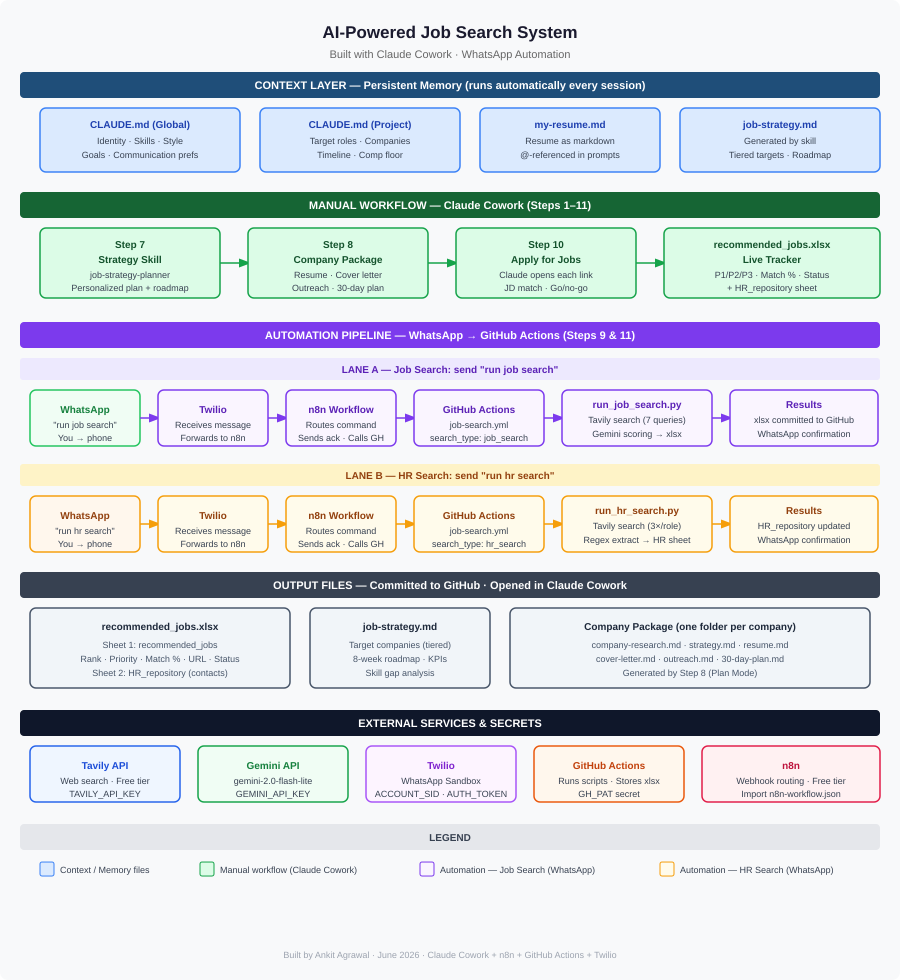

# AI-Powered Job Search System — Built with Claude Cowork

A personal job search assistant combining [Claude Cowork](https://claude.ai) no-code AI workflows with an optional WhatsApp automation layer for hands-free job hunting.

This project turns Claude into a persistent, context-aware job search partner that knows who you are, what you're targeting, and can generate tailored resumes, cover letters, outreach messages, company research, 30-day action plans, and a live job tracker — all from your own files. The automation layer (Steps 9 & 11) lets you trigger job searches and HR contact lookups by sending a single WhatsApp message — results are committed to GitHub and confirmed back on WhatsApp.



---

## Table of Contents

1. [Project Overview](#1-project-overview)
2. [Architecture & How It Works](#2-architecture--how-it-works)
3. [Folder Structure](#3-folder-structure)
4. [Prerequisites](#4-prerequisites)
5. [Step-by-Step Tutorial](#5-step-by-step-tutorial)
   - [Step 1 — Set Up Your Workspace](#step-1--set-up-your-workspace)
   - [Step 2 — Convert Your Resume to Markdown](#step-2--convert-your-resume-to-markdown)
   - [Step 3 — Create the Global CLAUDE.md (Who You Are)](#step-3--create-the-global-claudemd-who-you-are)
   - [Step 4 — Create the Project CLAUDE.md (Job Search Context)](#step-4--create-the-project-claudemd-job-search-context)
   - [Step 5 — Write Your Job Strategy Template](#step-5--write-your-job-strategy-template)
   - [Step 6 — Build the Job Strategy Planner Skill](#step-6--build-the-job-strategy-planner-skill)
   - [Step 7 — Run the Skill to Generate Your Strategy](#step-7--run-the-skill-to-generate-your-strategy)
   - [Step 8 — Build a Company-Specific Package (Plan Mode)](#step-8--build-a-company-specific-package-plan-mode)
   - [Step 9 — Find & Track Jobs (now automated)](#step-9--find--track-jobs-now-automated)
   - [Step 10 — Apply for Jobs](#step-10--apply-for-jobs)
   - [Step 11 — Find HR Contacts & Reach Out Directly (now automated)](#step-11--find-hr-contacts--reach-out-directly-now-automated)
   - [Step 12 — WhatsApp Automation Setup](#step-12--whatsapp-automation-setup)
6. [How to Run It](#6-how-to-run-it)
7. [Prompt Reference (All Prompts in One Place)](#7-prompt-reference-all-prompts-in-one-place)

---

## 1. Project Overview

Job searching is repetitive, manual, and mentally draining. This project automates the high-effort parts using Claude as an AI assistant that has full context about who you are and what you want.

**What it does:**

- Maintains a persistent "memory" of your background, goals, and constraints across every Claude session — so you never have to re-explain yourself
- Generates a personalized, data-driven job search strategy using a custom AI skill you build once and reuse forever
- Creates company-specific packages (tailored resume, cover letter, outreach messages, company research, 30-day action plan) with a single prompt
- Tracks all job opportunities in a structured xlsx, prioritized by match percentage, location, and posting date
- Walks you through applying to jobs — opening each link, matching the JD to your resume, getting your confirmation, and updating the tracker
- **[Automated]** Finds new PM job openings on demand — send "run job search" on WhatsApp, results appear in your xlsx within 3 minutes
- **[Automated]** Searches for HR contacts (recruiters, hiring managers) for all P1/P2 unapplied jobs — send "run hr search" on WhatsApp

**Who this is for:**

Anyone job searching who wants to use AI as a real productivity multiplier — not just to polish a cover letter, but to run the entire operation. Especially useful for senior professionals where every application needs to be precise and tailored.

---

## 2. Architecture & How It Works

The system is built on three concepts native to Claude Cowork: **CLAUDE.md context files**, **custom skills**, and **file referencing**.

### Concept 1: CLAUDE.md as Persistent Memory

Claude reads any file named `CLAUDE.md` in your connected folder automatically at the start of every session. This is your persistent memory layer — Claude knows who you are before you type a single word.

This project uses **two CLAUDE.md files** at different levels:

| File | Location | Purpose |
|---|---|---|
| Global CLAUDE.md | `job-search-project/CLAUDE.md` | Who you are — background, skills, communication style, what you'll ask for |
| Project CLAUDE.md | `job-search-project/job-search/CLAUDE.md` | Job-search-specific — target roles, target companies, constraints, working instructions |

The global one sets the identity layer. The project one sets the operational layer. Together, they replace the "let me give you some context" preamble you'd otherwise type every single session.

### Concept 2: Custom Skills

A **skill** is a reusable Claude behavior you define once in a `SKILL.md` file. It contains the goal, trigger conditions, step-by-step instructions for Claude to follow, and output requirements. Once saved, you activate it in any session by invoking its name.

This project includes one skill:

| Skill | Location | What It Does |
|---|---|---|
| `job-strategy-planner` | `job-strategy-planner/SKILL.md` | Collects your resume + LinkedIn profile, asks follow-up questions, and generates a complete personalized job search strategy using your own template |

### Concept 3: File Referencing with @

In Claude Cowork, you can reference any file in your connected folder using `@filename.md`. Claude reads the file inline as part of your prompt. This is how you pass your resume, strategy, or job list into any instruction without copy-pasting.

For example: `@my-resume.md` makes Claude read your resume before acting on whatever you ask next.

### Concept 4: WhatsApp Automation Pipeline

Steps 9 and 11 are now fully automated via a webhook-driven pipeline. You send a WhatsApp message → the system does the work → results are saved to GitHub and you receive a WhatsApp confirmation.

```
WhatsApp Message ("run job search" / "run hr search")
    │
    ▼
Twilio (receives message, forwards to n8n webhook)
    │
    ▼
n8n Workflow (routes by command, sends acknowledgement back to WhatsApp)
    │
    ▼
GitHub Actions (triggered via workflow_dispatch API)
    │
    ├── run_job_search.py  → Tavily web search → Gemini AI scoring → appends to recommended_jobs.xlsx
    └── run_hr_search.py   → Tavily web search → regex extraction → updates HR_repository sheet
    │
    ▼
Git commit + push → GitHub
    │
    ▼
WhatsApp confirmation message with result summary
```

**Key components:**

| Component | Role |
|---|---|
| Twilio WhatsApp Sandbox | Receives your WhatsApp message and forwards to n8n |
| n8n (self-hosted or cloud) | Routes commands, sends ack, calls GitHub Actions API |
| GitHub Actions | Runs Python scripts in a clean Ubuntu environment |
| `run_job_search.py` | Tavily search + Gemini AI to score/rank jobs; appends to xlsx |
| `run_hr_search.py` | Tavily search + regex to extract HR contacts; updates HR_repository sheet |
| `recommended_jobs.xlsx` | Single source of truth — updated by both scripts and committed to GitHub |

### How a Session Works

```
Session Start
    │
    ▼
Claude reads CLAUDE.md (global) + CLAUDE.md (job-search/)
    │
    ▼
You type a prompt with @file references
    │
    ├── Resume tailoring?     → Claude uses @my-resume.md + company JD
    ├── Company package?      → Plan mode builds 6 files in sequence
    ├── Job search?           → Claude searches, ranks, appends to recommended_jobs.xlsx
    │                            OR send "run job search" on WhatsApp for fully automated run
    ├── Apply?                → Claude opens each link, matches JD, waits for your go/no-go
    └── HR contacts?          → Claude searches and populates HR_repository sheet
                                 OR send "run hr search" on WhatsApp for fully automated run
```

### Key Design Decisions

**Why markdown files, not a database?** Markdown is readable, versionable (Git-friendly), and directly referenceable with `@`. No setup required.

**Why a template for the strategy?** A template enforces consistent structure across every strategy generated — whether it's for you or for someone else rebuilding this. It also makes the skill deterministic: Claude fills in real data, it doesn't hallucinate a format.

**Why two CLAUDE.md files?** The global one (job-search-project/) is identity — it doesn't change. The project one (job-search/) is operational — it changes as your search evolves. Separating them keeps both clean and focused.

---

## 3. Folder Structure

```
job-search-project/                    ← Global folder (connected to Claude Cowork)
│
├── CLAUDE.md                          ← Global identity: who you are, how you work
├── README.md                          ← This file
│
├── .github/
│   └── workflows/
│       └── job-search.yml             ← GitHub Actions: runs job search & HR search scripts
│
├── scripts/
│   └── whatsapp-job-search/
│       ├── run_job_search.py          ← Automated job search: Tavily + Gemini → xlsx
│       ├── run_hr_search.py           ← Automated HR search: Tavily + regex → HR_repository sheet
│       └── n8n-workflow.json          ← n8n workflow export (import this into your n8n instance)
│
├── job-strategy-planner/
│   └── SKILL.md                       ← Custom Claude skill for job strategy generation
│
└── job-search/                        ← Working folder for active job search
    ├── CLAUDE.md                      ← Job-search context: targets, constraints, working rules
    ├── my-resume.md                   ← Resume converted from PDF to markdown
    ├── job-strategy-plan-template.md  ← Manually written strategy template (input to skill)
    ├── job-strategy-ankit-2026.md     ← Generated strategy output (produced by skill)
    ├── recommended_jobs.xlsx          ← Live job tracker: ranked, prioritized, with status
    │                                     (also contains HR_repository sheet)
    │
    └── Agoda/                         ← Company-specific package (one folder per company)
        ├── agoda-company-research.md  ← Company overview, PM culture, product bets
        ├── agoda-strategy.md          ← Application strategy for this specific role
        ├── agoda-resume-ankit.md      ← Resume tailored to Agoda's JD
        ├── agoda-cover-letter.md      ← Cover letter (~215 words)
        ├── agoda-outreach.md          ← LinkedIn DM and email variants (A/B/C)
        └── agoda-30-day-plan.md       ← Day-by-day action plan: apply → offer
```

**Pattern to follow:** Every company you target gets its own subfolder inside `job-search/`. Each subfolder gets the same 6-file package generated by one Plan Mode prompt.

---

## 4. Prerequisites

**For the core system (Steps 1–11 manual):**
- Claude Desktop App with Cowork mode enabled
- A resume in PDF format
- A LinkedIn profile (URL is enough)
- No coding or API keys required

**For the WhatsApp automation (Step 12):**
- GitHub account with the repo pushed (for GitHub Actions)
- [Tavily API key](https://tavily.com) (free tier) — for web search
- [Gemini API key](https://aistudio.google.com) (free tier) — for job scoring in `run_job_search.py`
- [Twilio account](https://twilio.com) with WhatsApp Sandbox enabled (free)
- [n8n](https://n8n.io) instance — cloud or self-hosted (free tier available)
- GitHub Personal Access Token (PAT) with `repo` + `workflow` scopes

---

## 5. Step-by-Step Tutorial

This section walks you through exactly how this project was built — step by step, including the exact prompts used at each stage.

---

### Step 1 — Set Up Your Workspace

Create two folders on your computer:

```
job-search-project/       ← Connect this to Claude Cowork as your global folder
└── job-search/           ← This is your working folder for active search
```

In Claude Cowork, select `job-search-project` as your connected folder. Claude will automatically read any `CLAUDE.md` file it finds here at the start of every session.

---

### Step 2 — Convert Your Resume to Markdown

**Why:** Claude works best with text-based files it can read and reference inline. Converting your PDF resume to markdown makes it referenceable with `@my-resume.md` in any prompt.

**How:**

1. Open Claude Cowork
2. Upload your `resume.pdf` using the attachment button
3. Type this prompt:

```
Create a resume.md file for the resume.pdf file provided.
```

Claude will extract all content from your PDF and save a clean `my-resume.md` file in your connected folder.

**Output:** `job-search/my-resume.md`

---

### Step 3 — Create the Global CLAUDE.md (Who You Are)

**Why:** This is the identity layer — the file Claude reads first in every session. It tells Claude your background, expertise, goals, and communication preferences so you never have to explain yourself again.

**How:**

With `my-resume.md` already in your folder, type this prompt:

```
@my-resume.md Use my resume above to write my CLAUDE.md — the file that tells Claude who I am, 
how I work, and what I'm trying to accomplish, so every future session starts with full context about me. Include:

* My background and current role/stage
* My core skills and domain expertise
* My career goals and what I'm optimizing for
* How I like to work and communicate (concise, structured, no fluff)
* What kind of help I'll typically be asking for

Write this as a tight, scannable CLAUDE.md — bullet points, no filler. Claude should be able to read 
this and immediately know who I am and how to be most useful to me. After writing it, save the result 
to job-search-project.
```

**Output:** `job-search-project/CLAUDE.md`

**What it produces:** A structured profile with sections for who you are, your domain expertise, career goals, communication preferences, and the types of tasks you'll bring to Claude.

> **Tip:** After Claude generates this file, read it and edit anything that's off. This file persists forever — the more accurate it is, the more useful every future session becomes.

---

### Step 4 — Create the Project CLAUDE.md (Job Search Context)

**Why:** The global CLAUDE.md handles identity. This one handles operations — it tells Claude what you're targeting right now: specific roles, companies, timeline, location, comp floor. It also contains working instructions so Claude never gives you generic advice.

**How:**

This prompt triggers an interactive flow — Claude asks you four questions before writing the file:

```
@my-resume.md Using my resume above, write the local CLAUDE.md for my current job search project. 
Before writing anything, use the askUserQuestion tool to ask:

1. target timeline — when do I need an offer by?
2. location preference — remote, specific cities, or open to relocation?
3. compensation floor — minimum base salary I'll consider
4. current search stage — just starting, actively applying, or already interviewing?

Then write the CLAUDE.md using both my resume and my answers. Include:

* My target roles (be specific — titles I should be applying for given my background)
* Target companies (if I haven't specified, suggest 5-8 that match my profile)
* My constraints: timeline, location, compensation floor, search stage
* Working instructions for this project: when I ask for job strategy, always reference my actual 
  experience. Don't give generic advice.

Save the result to job-search in this folder.
```

Claude will ask you:
- When do you need an offer?
- Where are you open to working?
- What's your minimum acceptable salary?
- What's your current application stage?

Answer these directly in the chat. Claude uses your answers + your resume to write a job-search-specific CLAUDE.md with your target role titles, a company list tiered by fit, your constraints as a table, and working instructions that force Claude to ground every recommendation in your actual experience.

**Output:** `job-search/CLAUDE.md`

---

### Step 5 — Write Your Job Strategy Template

**Why:** The strategy template defines the structure of every job search strategy generated by your custom skill. Writing it once gives you a repeatable, consistent output every time the skill runs — for you or for anyone rebuilding this system.

**How:** Write this file manually. It is not generated by Claude — it's your own document defining what a good strategy looks like.

The template should include sections for:

- **Strategy Statement** — one-sentence goal (role, level, timeline, compensation target)
- **Step 1: Diagnosis** — current situation, challenges, opportunities, market/competitive analysis
- **Step 2: Guiding Policy** — overall approach, core principles (non-negotiables), long-term goal, SMART short-term objectives
- **Step 3: Action Plan & Roadmap** — key initiatives, resource allocation, support system, milestones table, weekly KPIs
- **Skill Gap Analysis** — a table of gaps, specific actions to close each

Use placeholder text (like `[User's Name]` or `[fill in]`) wherever user-specific data will be inserted by Claude. Save the file as:

**Output:** `job-search/job-strategy-plan-template.md`

> See the actual template in this repo at `job-search/job-strategy-plan-template.md` for a complete example you can copy directly.

---

### Step 6 — Build the Job Strategy Planner Skill

**Why:** A skill is a reusable Claude behavior. Instead of writing a long prompt every time you want a job strategy, you invoke the skill once and Claude knows exactly what to collect and how to format the output.

**How:**

With `job-strategy-plan-template.md` in your folder, use the skill-creator tool in Claude Cowork with this prompt:

```
@job-strategy-plan-template.md Create a skill named job-strategy-planner:

Goal
This skill helps users generate personalized job search strategies using the template attached to you.

Behavior
Trigger this skill whenever a user asks about:
* Job strategy
* Career planning
* Job switch
* Job preparation
* Breaking into a role/company

Instructions
* Use the askUserQuestion tool to gather required information from the user.
* You MUST collect the following before generating any strategy:
   * Resume (text or file)
   * LinkedIn profile
* Do NOT generate any strategy until both Resume and LinkedIn profile are provided.
* After collecting the required inputs, continue asking follow-up questions using the askUserQuestion 
  tool to improve context, such as:
   * Target role(s)
   * Target company (if any)
   * Experience level
   * Constraints (time, location, timeline, etc.)
* Keep asking questions until you have sufficient context.

Output Requirements
The final output MUST strictly follow the structure and format of the provided template 
(@job-strategy-plan-template.md). Do NOT deviate from the template format. Replace template 
placeholders with user-specific data only. After generating the strategy, save the final output 
to a file (e.g., job-strategy.md).

Rules
Do NOT perform any evaluation or test case — just create a skill.
Do NOT generate generic responses.
Always prioritize better context before answering.
Think like a career coach + recruiter.
```

**Output:** `job-strategy-planner/SKILL.md`

This creates a skill Claude can invoke in any future session. The skill enforces: collect resume first, collect LinkedIn second, ask follow-up questions, then and only then generate a strategy that strictly follows your template.

---

### Step 7 — Run the Skill to Generate Your Strategy

**Why:** This is where the skill pays off. You kick it off with a rough strategy statement, Claude collects all required inputs interactively, then produces a complete, personalized strategy saved to a file.

**How:**

In a new Claude session, type:

```
I will transition into a [role] at [level] by building real AI products in [domain], creating strong 
public proof of work, and consistently applying with targeted signals — aiming to secure the role 
in [X months] and reach [$X compensation] within [timeframe].
```

Fill in your actual blanks. Claude recognizes this as a job strategy trigger, invokes the `job-strategy-planner` skill, and begins its collection flow:

1. Asks for your resume (reference `@my-resume.md` or paste it)
2. Asks for your LinkedIn profile URL
3. Asks follow-up questions (target roles, companies, constraints, differentiators)
4. Generates the strategy using your template's exact structure — filled with your real data
5. Saves the file automatically

**Output:** `job-search/job-strategy-ankit-2026.md` (or whatever name you specify)

**What the output contains:** A strategy statement, situation diagnosis, challenges and opportunities, tiered target company list (20–40 companies), guiding policy, SMART objectives table, 8-week implementation roadmap, weekly KPIs to track, and a skill gap analysis with specific actions for each gap.

> **Tip:** The strategy file becomes a key input to everything else — the job finder, company packages, and cover letters all reference it. The more specific your answers during the skill's question flow, the sharper the output.

---

### Step 8 — Build a Company-Specific Package (Plan Mode)

**Why:** Each serious application deserves a tailored package: company research, a repositioned resume, a tight cover letter, outreach messages for LinkedIn and email, and a day-by-day action plan from application to offer. Doing this manually would take hours. Plan Mode does it in one approved prompt.

**How:**

Plan Mode in Claude Cowork lets Claude lay out its full plan before doing any work. You review it, approve it, and then Claude executes — creating all files in the right order.

Use this prompt:

```
@my-resume.md Plan mode: I want you to build me a complete job search package for a Senior Product 
Manager role at [Company Name]. Before doing anything, lay out your plan — what you'll create, in 
what order, and what files you'll save. Wait for my approval before starting.
```

Claude will respond with a plan listing all 6 files it intends to create and the order of operations. Once you approve (type "yes" or "looks good"), Claude executes the plan and saves all files to a company-specific folder.

**Output for each company (e.g., `job-search/Agoda/`):**

| File | Contents |
|---|---|
| `agoda-company-research.md` | Company overview, recent product bets, PM culture signals, how your background maps to their priorities, talking points for interviews, red flags |
| `agoda-strategy.md` | Positioning angle, application channel priority (referral → direct → cold), gap bridge plan, competitive landscape, non-negotiables |
| `agoda-resume-ankit.md` | Full resume with summary rewritten to lead with the most relevant proof points for this specific role |
| `agoda-cover-letter.md` | ~200-word cover letter with a specific hook, your strongest relevant proof point, and a clear bridge to their current product bets |
| `agoda-outreach.md` | 3 outreach message variants: LinkedIn DM to recruiter, cold email, LinkedIn DM via referral — each under 80 words |
| `agoda-30-day-plan.md` | Week-by-week action table from Day 1 (apply + activate referrals) to Day 30 (offer decision), with daily actions, time estimates, and impact ratings |

**To build packages for more companies:** Repeat this step with a different company name. Each company gets its own folder.

---

### Step 9 — Find & Track Jobs (now automated)

> **Automated option:** If you've completed Step 12, just send *"run job search"* on WhatsApp. The pipeline does everything below automatically and messages you when done (~2–3 min). Skip to Step 12 to set it up.

**Why:** Instead of manually scrolling job boards, you can have Claude search for open roles, match them against your resume and strategy, rank them, and maintain a structured tracker — all in one prompt.

**How:**

```
You have access to the following inputs:

1. My resume (@my-resume.md) — skills, experience, roles, preferences
2. My job search strategy (@job-strategy-ankit-2026.md) — target roles, locations, constraints, priorities
3. A @recommended_jobs.xlsx file containing jobs with status applied. Ignore if not present.

Your task:
* Analyze my resume to understand my skills, experience level, and role fit
* Use my job search strategy to define what "relevant jobs" mean for me
* Read the xlsx file and identify companies, roles, and job types I have already applied to
* Avoid suggesting duplicate roles or the same company + role combinations

Now do the following:
1. Search for new and relevant job openings that match my resume and strategy
2. Prioritize jobs posted in the last 24–48 hours
3. Rank jobs by relevance (best fit first)
4. For each job, extract:
   * Company Name
   * Job Title
   * Location
   * Job Type (remote / hybrid / onsite)
   * Experience Level
   * Job Posting Date
   * Job URL
   * Short reason why this role is a good match for me
   * Short description on what it takes to be a best match
   * Match Score (out of 100)
   * Reason for the score
   * Scoring Criteria:
     * 90–100: Strong match (high alignment with skills and experience)
     * 75–89: Good match (minor gaps)
     * 60–74: Moderate match
     * Below 60: Exclude

Output:
* Create a xlsx file named recommended_jobs.xlsx. If already present, append new jobs to the end.
* Store all selected job listings in this xlsx.
```

**Output:** `job-search/recommended_jobs.xlsx`

**XLSX columns:** Rank, Priority (P1/P2/P3/P4), Company Name, Job Title, Location, Job Type, Experience Level, Job Posting Date, Match Score (/100), Score Reason, Job URL, Why Good Match, What Is Missing / Gap, Priority Rationale, Status (applied / blank)

**Scoring & Priority logic:**
- **P1 – Apply Now:** Score 90–100 — strong alignment with skills and experience
- **P2 – Apply This Week:** Score 75–89 — good match with minor gaps
- **P3 – Apply If Bandwidth:** Score 60–74 — moderate match, worth tracking
- **Excluded:** Score below 60

> **Run this prompt regularly** — every few days — to add fresh postings. Claude reads the existing XLSX, skips companies you've already applied to, and appends new rows.

---

### Step 10 — Apply for Jobs

**Why:** The tracker is only useful if you act on it. This prompt turns the XLSX into an active application workflow — Claude opens each job link, does a fresh JD-to-resume match, shows you the quality assessment, waits for your go/no-go, and updates the tracker as you go.

**How:**

Upload your `resume.pdf` (for form submissions) alongside this prompt:

```
Use the file @recommended_jobs.XLSX and my resume @resume.pdf. Pick the combination of:
1. Non-applied jobs
2. P1 priority

* Open each job link (filtered based on the above combination) using the browser tool, and if the 
  Job Description is available/accessible:
  * Do a thorough match of the job against the resume
  * Give a brief description on the quality of match and what is missing or non-negotiable
  * Get a confirmation from me if I want to continue to apply
  * If my answer is yes, apply to the relevant role
  * If my answer is no, use the info to update the respective columns (Priority, Match %, Why Good 
    Match, What Is Missing) for that job in @recommended_jobs.xlsx. Then move to the next job link.

* If the JD is not available, analyse my resume and match it with the job data already in the xlsx.

How to apply:
* Guide me through submitting each application, or complete the steps you can do yourself
* If a job page doesn't load or isn't found, skip it and move to the next job link

Important: Before moving to the next job link, update @recommended_jobs.xlsx with status "applied" 
for any job where the application was submitted.
```

**What happens in practice:**

1. Claude opens the first P1 job link in your browser
2. Claude reads the JD and matches it against your resume — shows match %, strengths, gaps
3. You type "yes" (apply) or "no" (skip)
4. If yes: Claude guides you through the form or completes what it can
5. If no: Claude updates the xlsx with revised match/gap notes and moves to the next job
6. After each application, the xlsx is updated with `status: applied`
7. Repeat until all P1 jobs are processed

---

### Step 11 — Find HR Contacts & Reach Out Directly (now automated)

> **Automated option:** If you've completed Step 12, just send *"run hr search"* on WhatsApp. The pipeline searches for HR contacts across all P1/P2 unapplied jobs, updates `HR_repository`, pushes to GitHub, and messages you when done (~3–4 min). Skip to Step 12 to set it up.

**Why:** Applying through job portals is table stakes. The faster path to an interview is a direct message to the recruiter or hiring manager — before or immediately after submitting the application. This step finds the right person at each company, constructs their email, and logs everything in the `HR_repository` sheet of your `recommended_jobs.xlsx`.

**How:**

Run this prompt after your `recommended_jobs.xlsx` has been populated (Step 9):

```
Now, look at the P1 and P2 jobs which are not applied in recommended_jobs.xlsx

1. Identify the relevant hiring manager or recruiter for each role.
2. Find their email addresses using reliable sources.

Output format for each job:
- Job Title
- Company Name
- Hiring Manager / Recruiter Name
- Email Address
- Source of Email (e.g., LinkedIn, company website, public directory, etc.)
- Confidence Level (High / Medium / Low based on source reliability)

Instructions: Prioritize accurate and verified email addresses. Clearly mention the source.
Avoid guessing or generating emails without a reliable source.

Create the new sheet with name HR_repository in the same xlsx file, if it does not exist already.
Add/append all these details in that sheet. If the job is already listed in the sheet then update
it else add a new row.
```

**What Claude does:**

1. Reads all P1 and P2 unapplied rows from `recommended_jobs.xlsx`
2. Searches LinkedIn, ZoomInfo, RocketReach, ContactOut, and company email pattern databases for each company's talent acquisition team
3. Identifies the most relevant recruiter or hiring manager by name and role
4. Constructs or verifies their email address using confirmed company email patterns
5. Logs everything in a new `HR_repository` sheet in the same xlsx

**Output:** `recommended_jobs.xlsx` — with a new `HR_repository` sheet added

**HR_repository columns:**

| Column | Description |
|---|---|
| Job Title | Role you're targeting |
| Company | Company name |
| Priority | P1 or P2 |
| Location | Job location |
| Contact Name | Recruiter or hiring manager's full name |
| Contact Role | Their title (e.g., Lead TA, Head of Product) |
| Email Address | Constructed or verified email |
| LinkedIn URL | Direct link to their LinkedIn profile |
| Source | Where the contact was found (LinkedIn, ZoomInfo, etc.) |
| Confidence Level | High / Medium / Low |
| Notes | Outreach guidance — e.g., "LinkedIn InMail preferred for FAANG" |

**Confidence levels explained:**

- **High** — Email confirmed by two or more third-party sources (ZoomInfo + ContactOut)
- **Medium** — Email pattern confirmed at 85%+ frequency for the company; one source showing masked email
- **Low** — Email constructed from pattern only; LinkedIn outreach recommended as primary channel

**How to use the contacts:**

Once you have the HR_repository data, reference it when building company packages (Step 8). The outreach messages Claude generates in `[company]-outreach.md` can be directly addressed to the specific recruiter found here.

> **Important:** For Large companies (Amazon, Microsoft, Uber), LinkedIn InMail consistently outperforms cold email — use the LinkedIn URL column, not the email, as your primary outreach channel. For startups (e.g., Sarvam AI), direct email to the hiring manager is often the fastest path.

> **Run this after every new batch of jobs** added in Step 9 — Claude will only process unapplied rows and will skip companies already in the HR_repository sheet.

---

## 6. How to Run It

### First-Time Setup (one time only)

1. Create the folder structure:
   ```
   job-search-project/
   └── job-search/
   ```

2. Open Claude Desktop App → Cowork mode → connect `job-search-project` as your folder

3. Upload your `resume.pdf` and run Step 2 to create `my-resume.md`

4. Run Step 3 to create the global `CLAUDE.md`

5. Run Step 4 to create the job-search `CLAUDE.md`

6. Write `job-strategy-plan-template.md` manually (Step 5) — copy the template in this repo as a starting point

7. Run Step 6 to build the `job-strategy-planner` skill

8. Run Step 7 to generate your personalized strategy

### Daily Usage (recurring)

| Task | How to trigger | Output |
|---|---|---|
| Find new job openings | Send *"run job search"* on WhatsApp (automated) | Appended to `recommended_jobs.xlsx` on GitHub |
| Find new job openings | Step 9 Claude prompt (manual) | Appended to `recommended_jobs.xlsx` |
| Find HR contacts for P1/P2 jobs | Send *"run hr search"* on WhatsApp (automated) | `HR_repository` sheet updated on GitHub |
| Find HR contacts for P1/P2 jobs | Step 11 Claude prompt (manual) | `HR_repository` sheet in xlsx |
| Apply to P1 jobs | Step 10 prompt | Updates xlsx with `applied` status |
| Build a company package | Step 8 prompt (Plan Mode) | New folder with 6 files |
| Update your strategy | Re-run Step 7 skill | Updated strategy file |

### Updating Your Context

When your situation changes (new constraint, updated comp floor, changed target companies), edit the relevant `CLAUDE.md` file directly. The changes take effect in the next session automatically — no re-prompting needed.

---

## 7. Prompt Reference (All Prompts in One Place)

A quick reference for every prompt used in this project.

---

**Convert resume PDF to markdown**
```
Create a resume.md file for the resume.pdf file provided.
```

---

**Create global CLAUDE.md**
```
@my-resume.md Use my resume above to write my CLAUDE.md — the file that tells Claude who I am, 
how I work, and what I'm trying to accomplish, so every future session starts with full context about me. Include:

* My background and current role/stage
* My core skills and domain expertise
* My career goals and what I'm optimizing for
* How I like to work and communicate (concise, structured, no fluff)
* What kind of help I'll typically be asking for

Write this as a tight, scannable CLAUDE.md — bullet points, no filler. Claude should be able to 
read this and immediately know who I am and how to be most useful to me.
After writing it, save the result to job-search-project.
```

---

**Create project CLAUDE.md (interactive)**
```
@my-resume.md Using my resume above, write the local CLAUDE.md for my current job search project. 
Before writing anything, use the askUserQuestion tool to ask:

1. target timeline — when do I need an offer by?
2. location preference — remote, specific cities, or open to relocation?
3. compensation floor — minimum base salary I'll consider
4. current search stage — just starting, actively applying, or already interviewing?

Then write the CLAUDE.md using both my resume and my answers. Include:

* My target roles (be specific — titles I should be applying for given my background)
* Target companies (if I haven't specified, suggest 5-8 that match my profile)
* My constraints: timeline, location, compensation floor, search stage
* Working instructions for this project: when I ask for job strategy, always reference my actual 
  experience. Don't give generic advice.

Save the result to job-search in this folder.
```

---

**Create the job-strategy-planner skill**
```
@job-strategy-plan-template.md Create a skill named job-strategy-planner:

Goal
This skill helps users generate personalized job search strategies using the template attached to you.

Behavior
Trigger this skill whenever a user asks about:
* Job strategy
* Career planning
* Job switch
* Job preparation
* Breaking into a role/company

Instructions
* Use the askUserQuestion tool to gather required information from the user.
* You MUST collect the following before generating any strategy:
   * Resume (text or file)
   * LinkedIn profile
* Do NOT generate any strategy until both Resume and LinkedIn profile are provided.
* After collecting the required inputs, continue asking follow-up questions using the askUserQuestion 
  tool to improve context, such as:
   * Target role(s)
   * Target company (if any)
   * Experience level
   * Constraints (time, location, timeline, etc.)
* Keep asking questions until you have sufficient context.

Output Requirements
The final output MUST strictly follow the structure and format of the provided template 
(@job-strategy-plan-template.md). Do NOT deviate from the template format. Replace template 
placeholders with user-specific data only. After generating the strategy, save the final output 
to a file (e.g., job-strategy.md).

Rules
Do NOT perform any evaluation or test case — just create a skill.
Do NOT generate generic responses.
Always prioritize better context before answering.
Think like a career coach + recruiter.
```

---

**Run the job-strategy-planner skill**
```
I will transition into a [role] at [level] by building real AI products in [domain], creating 
strong public proof of work, and consistently applying with targeted signals — aiming to secure 
the role in [X months] and reach [$X compensation] within [timeframe].
```

---

**Build a company-specific job search package (Plan Mode)**
```
@my-resume.md Plan mode: I want you to build me a complete job search package for a Senior Product 
Manager role at [Company Name]. Before doing anything, lay out your plan — what you'll create, in 
what order, and what files you'll save. Wait for my approval before starting.
```

---

**Find and track new job openings**
```
You have access to the following inputs:

1. My resume (@my-resume.md) — skills, experience, roles, preferences
2. My job search strategy (@job-strategy-ankit-2026.md) — target roles, locations, constraints, priorities
3. A @recommended_jobs.xlsx file containing jobs with status applied. Ignore if not present.

Your task:
* Analyze my resume to understand my skills, experience level, and role fit
* Use my job search strategy to define what "relevant jobs" mean for me
* Read the XLSX file and identify companies, roles, and job types I have already applied to
* Avoid suggesting duplicate roles or the same company + role combinations

Now do the following:
1. Search for new and relevant job openings that match my resume and strategy
2. Prioritize jobs posted in the last 24–48 hours
3. Rank jobs by relevance (best fit first)
4. For each job, extract:
   * Company Name
   * Job Title
   * Location
   * Job Type (remote / hybrid / onsite)
   * Experience Level
   * Job Posting Date
   * Job URL
   * Short reason why this role is a good match for me
   * Short description on what it takes to be a best match
   * Match Score (out of 100)
   * Reason for the score
   * Scoring Criteria:
     * 90–100: Strong match (high alignment with skills and experience)
     * 75–89: Good match (minor gaps)
     * 60–74: Moderate match
     * Below 60: Exclude

Output:
* Create a XLSX file named recommended_jobs.xlsx. If already present, append new jobs to the end.
* Store all selected job listings in this XLSX.
```

---

**Apply to P1 jobs from the tracker**
```
Use the file @recommended_jobs.xlsx and my resume @resume.pdf. Pick the combination of:
1. Non-applied jobs
2. P1 priority

* Open each job link (filtered based on the above combination) using the browser tool, and if the 
  Job Description is available/accessible:
  * Do a thorough match of the job against the resume
  * Give a brief description on the quality of match and what is missing or non-negotiable
  * Get a confirmation from me if I want to continue to apply
  * If my answer is yes, apply to the relevant role
  * If my answer is no, use the info to update the respective columns (Priority, Match %, Why Good 
    Match, What Is Missing) for that job in @recommended_jobs.xlsx. Then move to the next job link.

* If the JD is not available, analyse my resume and match it with the job data already in the XLSX.

How to apply:
* Guide me through submitting each application, or complete the steps you can do yourself
* If a job page doesn't load or isn't found, skip it and move to the next job link

Important: Before moving to the next job link, update @recommended_jobs.xlsx with status "applied" 
for any job where the application was submitted.
```

---

---

**Find HR contacts for P1/P2 jobs**
```
Now, look at the P1 and P2 jobs which are not applied in recommended_jobs.xlsx

1. Identify the relevant hiring manager or recruiter for each role.
2. Find their email addresses using reliable sources.

Output format for each job:
- Job Title
- Company Name
- Hiring Manager / Recruiter Name
- Email Address
- Source of Email (e.g., LinkedIn, company website, public directory, etc.)
- Confidence Level (High / Medium / Low based on source reliability)

Instructions: Prioritize accurate and verified email addresses. Clearly mention the source.
Avoid guessing or generating emails without a reliable source.

Create the new sheet with name HR_repository in the same xlsx file, if it does not exist already.
Add/append all these details in that sheet. If the job is already listed in the sheet then update
it else add a new row.
```

---

---

### Step 12 — WhatsApp Automation Setup

**Why:** Steps 9 and 11 are powerful but require you to open Claude, reference files, and wait for a session to complete. This step wires them up to WhatsApp so you can kick off a job search or HR contact lookup from your phone in seconds — results appear in your xlsx on GitHub automatically.

**How it works:** WhatsApp message → Twilio → n8n → GitHub Actions → Python script → xlsx updated → WhatsApp confirmation.

---

#### 12a — Push the repo to GitHub

The automation scripts live in `scripts/whatsapp-job-search/` and the workflow in `.github/workflows/job-search.yml`. Push everything to a GitHub repo:

```bash
git init
git remote add origin https://github.com/YOUR_USERNAME/job-search-project.git
git add .
git commit -m "Initial commit"
git push origin main
```

---

#### 12b — Add GitHub Secrets

In your repo → Settings → Secrets and variables → Actions, add these secrets:

| Secret name | Value |
|---|---|
| `GH_PAT` | GitHub Personal Access Token (repo + workflow scopes) |
| `TAVILY_API_KEY` | Your Tavily API key |
| `GEMINI_API_KEY` | Your Gemini API key (used by job search only) |
| `TWILIO_ACCOUNT_SID` | Your Twilio Account SID |
| `TWILIO_AUTH_TOKEN` | Your Twilio Auth Token |

---

#### 12c — Set Up Twilio WhatsApp Sandbox

1. Go to [Twilio Console](https://console.twilio.com) → Messaging → Try it out → Send a WhatsApp message
2. Follow the sandbox join instructions (send a WhatsApp message to the Twilio number)
3. Note your Twilio sandbox number (e.g., `+14155238886`) — it's hardcoded in the Python scripts as `TWILIO_FROM`

---

#### 12d — Import and Configure n8n Workflow

1. Open your n8n instance
2. Import `scripts/whatsapp-job-search/n8n-workflow.json`
3. In the workflow, update these placeholders with real values:
   - `YOUR_TWILIO_ACCOUNT_SID` and `YOUR_TWILIO_AUTH_TOKEN` — in all three "Reply" HTTP Request nodes (in the URL field)
   - `YOUR_GITHUB_USERNAME` — in both "Trigger Job Search" and "Trigger HR Search" nodes
   - `YOUR_N8N_CREDENTIAL_ID` — configure a Header Auth credential with `Authorization: token YOUR_GITHUB_PAT` and reference it in both GitHub trigger nodes
4. Activate the workflow (toggle to Published/Active)

**Workflow node map:**

| Node | Type | What it does |
|---|---|---|
| Twilio Webhook | Webhook | Receives POST from Twilio when you send a WhatsApp message |
| Acknowledge Twilio | Respond to Webhook | Returns empty TwiML `<Response/>` immediately (required by Twilio) |
| Is Job Search? | IF | Checks if message body contains "job search" |
| Is HR Search? | IF | Checks if message body contains "hr search" |
| Trigger Job Search (GitHub Actions) | HTTP Request | POSTs to GitHub API to dispatch `job-search.yml` with `search_type: job_search` |
| Trigger HR Search (GitHub Actions) | HTTP Request | POSTs to GitHub API to dispatch `job-search.yml` with `search_type: hr_search` |
| Reply: Job Search Started | HTTP Request | Sends WhatsApp ack back to you via Twilio REST API |
| Reply: HR Search Started | HTTP Request | Sends WhatsApp ack back to you via Twilio REST API |
| Reply: Unknown Command | HTTP Request | Sends help message if command not recognized |

---

#### 12e — Connect Twilio to n8n

In Twilio → Messaging → Sandbox settings → "When a message comes in", paste your n8n **production** webhook URL:

```
https://YOUR_N8N_INSTANCE/webhook/whatsapp-job-search
```

> Use the **Production URL** (not the Test URL) — they use different JSON structures and the workflow is built for production.

---

#### 12f — Trigger it

Send any of these messages to your Twilio WhatsApp number:

| Message | What happens |
|---|---|
| `run job search` | Searches for new PM jobs, scores with Gemini, appends to xlsx |
| `run hr search` | Finds HR contacts for all P1/P2 unapplied jobs, updates HR_repository |

Results are committed to GitHub and you receive a WhatsApp confirmation with a summary and link to the updated xlsx.

---

#### How the scripts work

**`run_job_search.py`**
1. Reads `my-resume.md` and `job-strategy-ankit-2026.md` for context
2. Runs 7 targeted Tavily searches for PM roles matching your profile
3. Sends all results to Gemini (`gemini-2.0-flash-lite`) to score, filter (≥60% match), and rank
4. Appends new jobs to `recommended_jobs.xlsx` (skips duplicates)
5. Commits and pushes to GitHub
6. Sends WhatsApp summary with job count and xlsx link

**`run_hr_search.py`**
1. Reads all P1/P2 unapplied rows from `recommended_jobs.xlsx`
2. For each role, runs 3 Tavily searches (recruiter name, LinkedIn, email)
3. Extracts contact info via regex — LinkedIn URLs, emails, names near recruiter keywords
4. Upserts rows into `HR_repository` sheet with confidence level (High/Medium/Low)
5. Commits and pushes to GitHub
6. Sends WhatsApp summary with contact count and xlsx link

> No LLM is used in `run_hr_search.py` — extraction is entirely regex-based to avoid API rate limits.

---

*Built by Ankit Agrawal · June 2026 · Using Claude Cowork*
